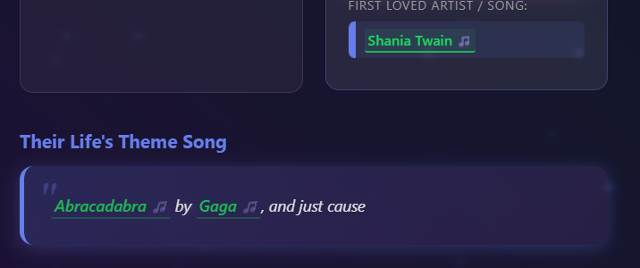

# Music Taste Matcher
**Find Your Sonic Twin**

A Van AI Hackathon Round 4 Project

## Team Members

- Rowan Monk

## Project Overview

Music Taste Matcher is an AI-powered web application that connects people through their unique relationship with music. 

When users answer six thoughtfully crafted, open ended questions about their own musical identity, our application uses AI models to perform semantic matching, finding the survey respondent whose musical DNA most closely mirrors theirs. This isn't just about matching favorite genres or artists, it's about matching the deeper relationship people have with music: how they discover it, when they listen, how intensely they engage, and how they share it with others.

Once the match is found, users discover their twin's complete music profile, enriched with inline Spotify links to explore their favorite artists and songs directly. Our AI analysis provides personalized insights explaining why they were paired together, highlighting genuine connections in their responses. To visualize these musical identities, we generate custom illustrated avatars for both the user and their match, with artistic styles that reflect their attitudes toward AI, music intensity levels, and social sharing behaviors.

Music Taste Matcher transforms abstract survey data into meaningful human connections, proving that our relationship with music is as unique as our fingerprints and just as recognizable when you know what to look for.

## Technical Implementation

### Architecture & Stack

The application is built with a Python Flask backend and vanilla JavaScript frontend and uses the OpenAI python client library.

### Data Pipeline & Entity Extraction

The data processing pipeline consists of scripts that progressively enrich the survey data. We pass templated prompts to the gpt-4o-mini API to semantically analyze the contents of the open-ended survey responses. Removing low effort survey responses, extrapolating favorite songs/artists. Then finally, performing inline entity annotation to identify and markup songs & artists. A custom prompt instructs the model to wrap detected entities with delimiter-enclosed JSON metadata (`||{"type": "song", "name": "Track Name", "artist": "Artist Name"}matched_text||`). Each extraction undergoes validation to ensure non-overlapping annotations, correct JSON structure, and text content preservation. 

Extracted entities are enriched with Spotify metadata via the Spotify API, adding links that are rendered in the frontend.

Example Input:
```
Abracadabra by Gaga, and just cause
```

Example Output:
```
||{"type": "song", "name": "Abracadabra", "artist": "Lady Gaga"}Abracadabra|| by ||{"type": "artist", "name": "Lady Gaga"}Gaga||, and just cause
```

Example Usage:


### AI Survey Matching System

At the core is OpenAI's `text-embedding-3-small` model, which converts structured identity strings into vector representations for semantic similarity matching.

Identity strings are constructed documents that synthesize survey responses into a coherent narrative format. For each survey respondent, we programmatically assemble multi-line text that includes all the relevant survey information that embeddings can meaningfully encode.

When users complete the questionnaire, their answers are formatted into an equivalent identity string structure, ensuring structural alignment between user input and pre-computed survey embeddings. Cosine similarity search then identifies the survey respondent whose embedded identity vector is closest in semantic space, matching not just on explicit genre preferences but on deeper behavioral patterns, discovery habits, and emotional relationships with music.

### Avatar Image Generation

Our avatar generation system uses the gpt-image-1 model with dynamically constructed prompts. We map survey responses to key dimensions: AI attitude spectrum (embracer to rejector), and music intensity (obsessed to minimal) and favourite artist. Each dimension influences different aspects of the generated avatar aesthetic,  lighting, expression, and background elements. Prompt variations are randomized within categories to ensure visual diversity while maintaining thematic consistency.

## Setup & Installation

### Prerequisites

- Python 3.8+
- Environment Variables:
  - `OPENAI_API_KEY`
  - `SPOTIFY_CLIENT_ID`
  - `SPOTIFY_CLIENT_SECRET`


### Installation

1. Clone the repository:
```bash
git clone <repository-url>
```

2. Install dependencies:
```bash
pip install -r src/requirements.txt
```

3. Set environment variables:
```bash
export OPENAI_API_KEY="your-openai-api-key"
export SPOTIFY_CLIENT_ID="your-spotify-client-id"
export SPOTIFY_CLIENT_SECRET="your-spotify-client-secret"
```

4. Run the Flask application:
```bash
cd src
python app.py
```

5. Open your browser to `http://localhost:5000`

### Data Processing Pipeline (Optional)

To regenerate survey embeddings and entity extractions from original data: `data\raw\music_survey_data.csv`:

```bash
cd scripts
python 01_clean_data.py
python 02_extract_genre_bands.py
python 04_generate_survey_embeddings.py
python 05_extract_music_entities.py
python 06_extract_favourite_artist.py
```
